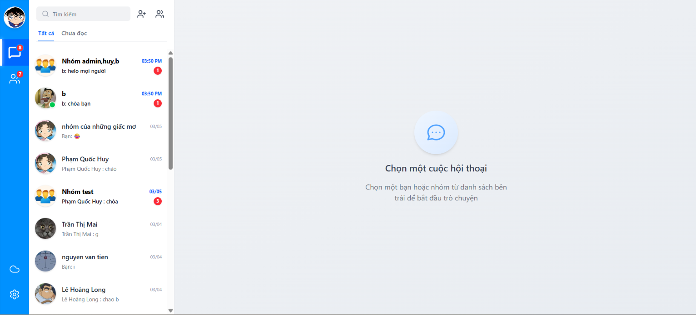
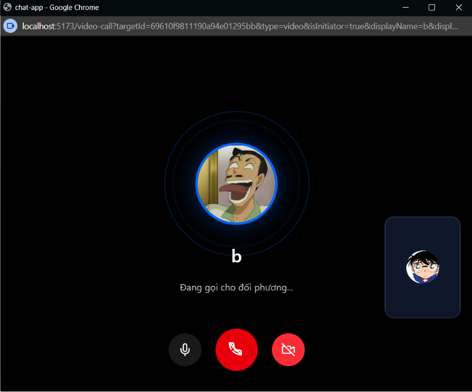
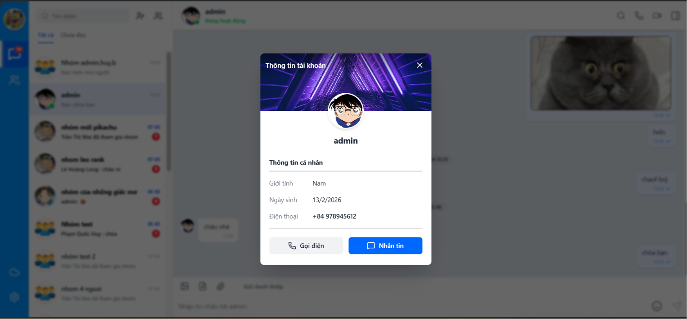
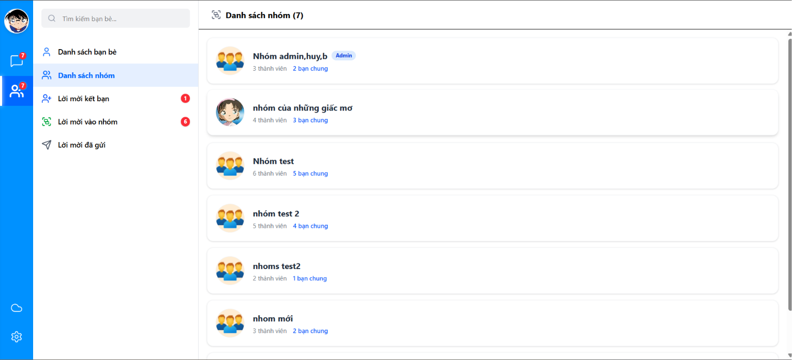

# MyChatApp - Real-time Microservices Chat Application

**MyChatApp** là một nền tảng nhắn tin thời gian thực hiện đại, được xây dựng trên kiến trúc Microservices mạnh mẽ. Ứng dụng hỗ trợ nhắn tin tức thời, gọi điện video P2P và quản lý tệp tin, tập trung vào tính bảo mật cao và khả năng mở rộng linh hoạt.

---

## Giao diện ứng dụng

### Chat Window


### Video Call


### Profile & Friends


### Tab Contact

---

## Tính năng chính

### Xác thực & Bảo mật (Auth & Security)
- **HttpOnly Cookie JWT**: Cơ chế xác thực an toàn vượt trội, ngăn chặn hoàn toàn các cuộc tấn công XSS.
- **API Gateway**: Cổng tập trung xử lý điều hướng (routing) và chuẩn hóa chính sách CORS cho toàn bộ hệ thống.

### Thời gian thực (Real-time)
- **Instant Messaging**: Nhắn tin tức thời với Socket.io.
- **Presence Status**: Theo dõi trạng thái hoạt động của bạn bè (Online/Offline).
- **WebRTC Call**: Gọi video/âm thanh trực tiếp (Peer-to-Peer).

### Quản lý phương tiện (Media)
- **Upload Service**: Dịch vụ chuyên biệt sử dụng Cloudinary và Multer để tối ưu hóa lưu trữ ảnh/video trên đám mây.

### Hệ thống & DevOps
- **Microservices**: Chia nhỏ hệ thống thành các dịch vụ độc lập (Auth, Chat, Friend, Upload).
- **Dockerized**: Đóng gói toàn bộ hệ thống bằng Docker, triển khai nhanh chóng với chỉ một câu lệnh.

---

## Tối ưu hiệu năng (Performance Optimization)

Để đảm bảo trải nghiệm mượt mà và tốc độ phản hồi nhanh, dự án đã triển khai các kỹ thuật tối ưu:

- **Message Pagination**: Sử dụng kỹ thuật phân trang (`limit` & `skip`) khi lấy lịch sử tin nhắn, giúp ứng dụng không bị lag ngay cả khi hội thoại có hàng ngàn tin nhắn.
- **Data Denormalization (Last Message)**: Tin nhắn mới nhất được lưu trực tiếp vào bản ghi của User/Group. Kỹ thuật này giúp trang chủ hiển thị danh sách cuộc trò chuyện ngay lập tức mà không cần phải duyệt qua toàn bộ database tin nhắn, giảm tải đáng kể cho MongoDB.
- **Selective Population**: Chỉ truy vấn và trả về các trường dữ liệu cần thiết (như `username`, `avatar`) thay vì toàn bộ thông tin người dùng, giúp giảm dung lượng JSON truyền tải và tăng tốc độ xử lý của trình duyệt.
- **Efficient State Updates**: Sử dụng React Hooks (`useCallback`, `useMemo`) để tránh render lại dư thừa, đảm bảo giao diện mượt mà khi nhận tin nhắn thời gian thực.

---

## Công nghệ sử dụng

- **Frontend**: React.js, Tailwind CSS, Framer Motion (Animations), Lucide Icons.
- **Backend**: Node.js, Express.js, Socket.io, WebRTC.
- **Database**: MongoDB (Mongoose).
- **Infrastructure**: API Gateway, Docker & Docker Compose.
- **Dịch vụ khác**: Cloudinary (Storage), JWT (Authentication).

---

## Cài đặt ứng dụng

### 1. Clone dự án
```bash
git clone https://github.com/Nghmin/MyChatApp.git
cd MyChatApp
```

### 2. Triển khai bằng Docker 
Cài đặt Docker và chạy lệnh sau để khởi động toàn bộ hệ thống (Frontend, Backend, Database):
```bash
docker-compose up --build
```

### 3. Chạy thủ công
*Nếu muốn chạy từng dịch vụ một:*
- **Backend**: Vào từng folder trong `backend/services/`, chạy `npm install` và `npm start`.
- **Frontend**: Vào folder `frontend/client/`, chạy `npm install` và `npm run dev`.

---

## Liên hệ
- **Github**: [https://github.com/Nghmin](https://github.com/Nghmin)
- **Project Link**: [https://github.com/Nghmin/MyChatApp](https://github.com/Nghmin/MyChatApp)

